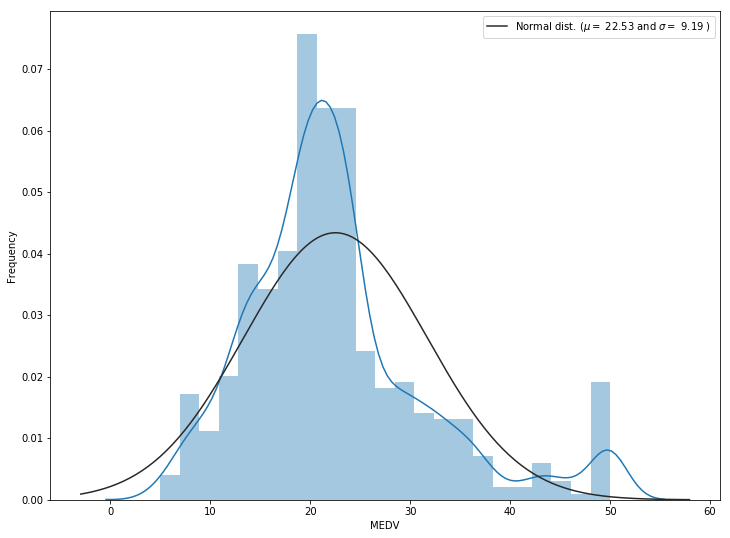
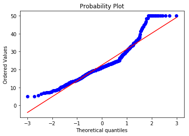
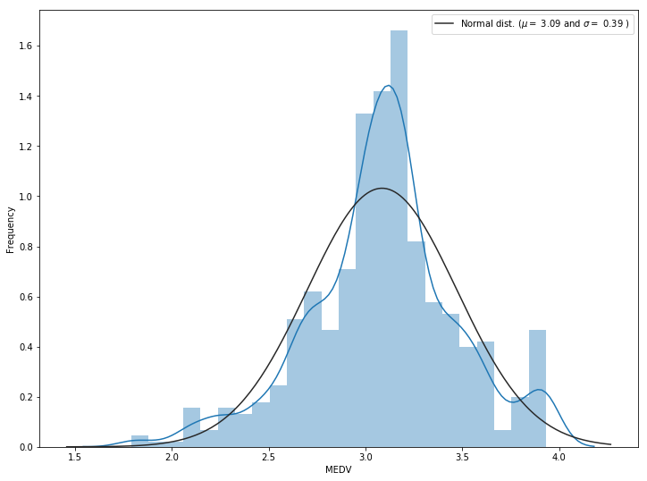
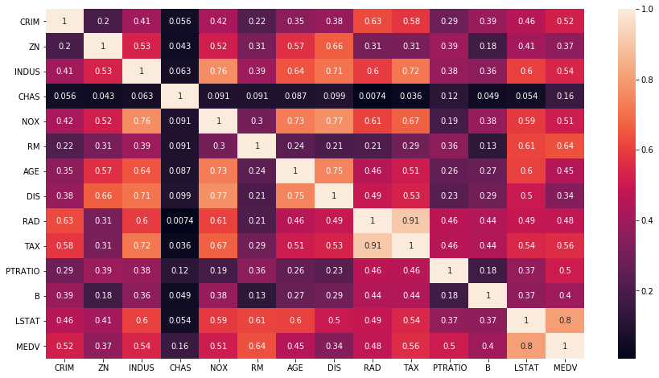
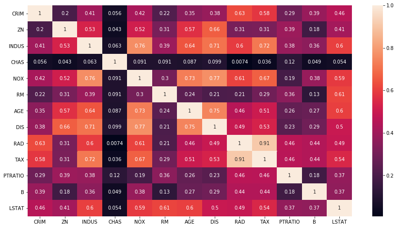
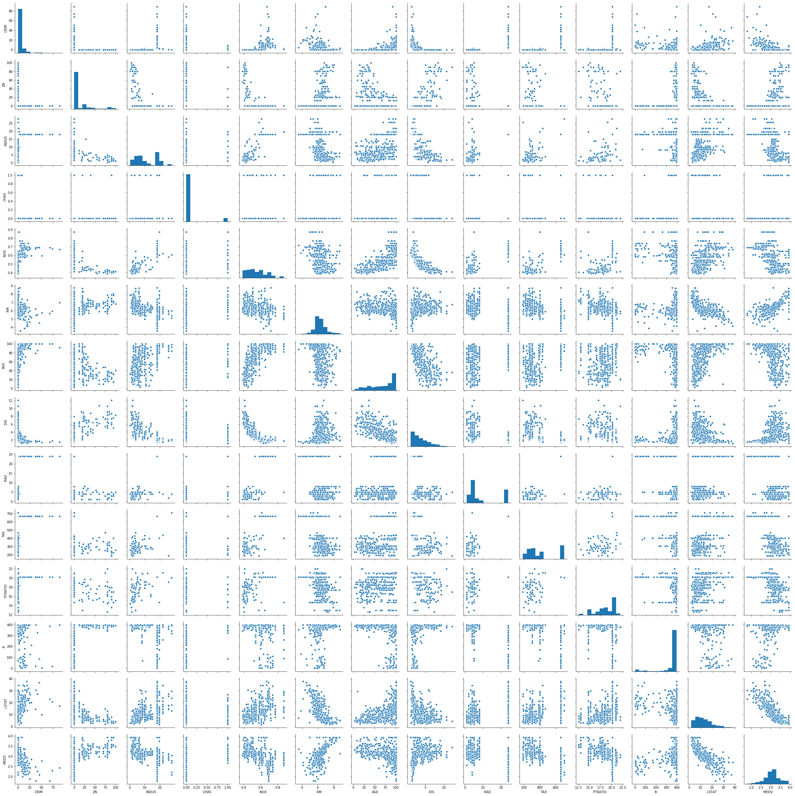
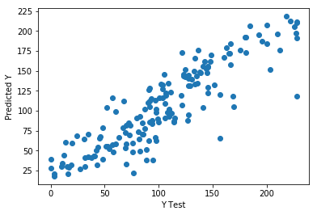
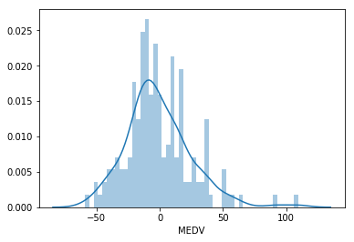

## Variables in order:
<p> CRIM per capita crime rate by town.<br />ZN proportion of residential land zoned for lots over 25,000 sq.ft.<br />INDUS proportion of non-retail business acres per town.<br />CHAS Charles River dummy variable (= 1 if tract bounds river; 0 otherwise).<br />NOX nitric oxides concentration (parts per 10 million).<br />RM average number of rooms per dwelling.<br />AGE proportion of owner-occupied units built prior to 1940.<br />DIS weighted distances to five Boston employment centres.<br />RAD index of accessibility to radial highways.<br />TAX full-value property-tax rate per 10,000 dollars.<br />PTRATIO pupil-teacher ratio by town.<br />B 1000(Bk - 0.63)^2 where Bk is the proportion of blacks by town.<br />LSTAT percent lower status of the population.<br />MEDV Median value of owner-occupied homes in 1000 dollars.</p>


```python
#Load libraries
import pandas as pd
import numpy as np
import seaborn as sns
import matplotlib.pyplot as plt
from scipy import stats

%matplotlib inline
```


```python
#Load dataset
filename = ("housing.csv")
names = ['CRIM', 'ZN', 'INDUS', 'CHAS', 'NOX', 'RM', 'AGE', 'DIS', 'RAD', 'TAX', 'PTRATIO', 'B', 'LSTAT', 'MEDV']
data = pd.read_csv(filename, delim_whitespace=True, names=names)
data.columns=data.columns.str.strip() #remove white spaces from column
data= data.apply(lambda x: x.str.strip() if x.dtype == "object" else x) #remove white spaces from row

```


```python
data.head()
```


<div>
<style scoped>
    .dataframe tbody tr th:only-of-type {
        vertical-align: middle;
    }

    .dataframe tbody tr th {
        vertical-align: top;
    }

    .dataframe thead th {
        text-align: right;
    }
</style>
<table border="1" class="dataframe">
  <thead>
    <tr style="text-align: right;">
      <th></th>
      <th>CRIM</th>
      <th>ZN</th>
      <th>INDUS</th>
      <th>CHAS</th>
      <th>NOX</th>
      <th>RM</th>
      <th>AGE</th>
      <th>DIS</th>
      <th>RAD</th>
      <th>TAX</th>
      <th>PTRATIO</th>
      <th>B</th>
      <th>LSTAT</th>
      <th>MEDV</th>
    </tr>
  </thead>
  <tbody>
    <tr>
      <th>0</th>
      <td>0.00632</td>
      <td>18.0</td>
      <td>2.31</td>
      <td>0</td>
      <td>0.538</td>
      <td>6.575</td>
      <td>65.2</td>
      <td>4.0900</td>
      <td>1</td>
      <td>296.0</td>
      <td>15.3</td>
      <td>396.90</td>
      <td>4.98</td>
      <td>24.0</td>
    </tr>
    <tr>
      <th>1</th>
      <td>0.02731</td>
      <td>0.0</td>
      <td>7.07</td>
      <td>0</td>
      <td>0.469</td>
      <td>6.421</td>
      <td>78.9</td>
      <td>4.9671</td>
      <td>2</td>
      <td>242.0</td>
      <td>17.8</td>
      <td>396.90</td>
      <td>9.14</td>
      <td>21.6</td>
    </tr>
    <tr>
      <th>2</th>
      <td>0.02729</td>
      <td>0.0</td>
      <td>7.07</td>
      <td>0</td>
      <td>0.469</td>
      <td>7.185</td>
      <td>61.1</td>
      <td>4.9671</td>
      <td>2</td>
      <td>242.0</td>
      <td>17.8</td>
      <td>392.83</td>
      <td>4.03</td>
      <td>34.7</td>
    </tr>
    <tr>
      <th>3</th>
      <td>0.03237</td>
      <td>0.0</td>
      <td>2.18</td>
      <td>0</td>
      <td>0.458</td>
      <td>6.998</td>
      <td>45.8</td>
      <td>6.0622</td>
      <td>3</td>
      <td>222.0</td>
      <td>18.7</td>
      <td>394.63</td>
      <td>2.94</td>
      <td>33.4</td>
    </tr>
    <tr>
      <th>4</th>
      <td>0.06905</td>
      <td>0.0</td>
      <td>2.18</td>
      <td>0</td>
      <td>0.458</td>
      <td>7.147</td>
      <td>54.2</td>
      <td>6.0622</td>
      <td>3</td>
      <td>222.0</td>
      <td>18.7</td>
      <td>396.90</td>
      <td>5.33</td>
      <td>36.2</td>
    </tr>
  </tbody>
</table>
</div>


```python
#Visualize the data
data.shape
```


    (506, 14)


```python
data.info()
```

    <class 'pandas.core.frame.DataFrame'>
    RangeIndex: 506 entries, 0 to 505
    Data columns (total 14 columns):
    CRIM       506 non-null float64
    ZN         506 non-null float64
    INDUS      506 non-null float64
    CHAS       506 non-null int64
    NOX        506 non-null float64
    RM         506 non-null float64
    AGE        506 non-null float64
    DIS        506 non-null float64
    RAD        506 non-null int64
    TAX        506 non-null float64
    PTRATIO    506 non-null float64
    B          506 non-null float64
    LSTAT      506 non-null float64
    MEDV       506 non-null float64
    dtypes: float64(12), int64(2)
    memory usage: 55.4 KB
    


```python
data.describe()
```


<div>
<style scoped>
    .dataframe tbody tr th:only-of-type {
        vertical-align: middle;
    }

    .dataframe tbody tr th {
        vertical-align: top;
    }

    .dataframe thead th {
        text-align: right;
    }
</style>
<table border="1" class="dataframe">
  <thead>
    <tr style="text-align: right;">
      <th></th>
      <th>CRIM</th>
      <th>ZN</th>
      <th>INDUS</th>
      <th>CHAS</th>
      <th>NOX</th>
      <th>RM</th>
      <th>AGE</th>
      <th>DIS</th>
      <th>RAD</th>
      <th>TAX</th>
      <th>PTRATIO</th>
      <th>B</th>
      <th>LSTAT</th>
      <th>MEDV</th>
    </tr>
  </thead>
  <tbody>
    <tr>
      <th>count</th>
      <td>506.000000</td>
      <td>506.000000</td>
      <td>506.000000</td>
      <td>506.000000</td>
      <td>506.000000</td>
      <td>506.000000</td>
      <td>506.000000</td>
      <td>506.000000</td>
      <td>506.000000</td>
      <td>506.000000</td>
      <td>506.000000</td>
      <td>506.000000</td>
      <td>506.000000</td>
      <td>506.000000</td>
    </tr>
    <tr>
      <th>mean</th>
      <td>3.613524</td>
      <td>11.363636</td>
      <td>11.136779</td>
      <td>0.069170</td>
      <td>0.554695</td>
      <td>6.284634</td>
      <td>68.574901</td>
      <td>3.795043</td>
      <td>9.549407</td>
      <td>408.237154</td>
      <td>18.455534</td>
      <td>356.674032</td>
      <td>12.653063</td>
      <td>22.532806</td>
    </tr>
    <tr>
      <th>std</th>
      <td>8.601545</td>
      <td>23.322453</td>
      <td>6.860353</td>
      <td>0.253994</td>
      <td>0.115878</td>
      <td>0.702617</td>
      <td>28.148861</td>
      <td>2.105710</td>
      <td>8.707259</td>
      <td>168.537116</td>
      <td>2.164946</td>
      <td>91.294864</td>
      <td>7.141062</td>
      <td>9.197104</td>
    </tr>
    <tr>
      <th>min</th>
      <td>0.006320</td>
      <td>0.000000</td>
      <td>0.460000</td>
      <td>0.000000</td>
      <td>0.385000</td>
      <td>3.561000</td>
      <td>2.900000</td>
      <td>1.129600</td>
      <td>1.000000</td>
      <td>187.000000</td>
      <td>12.600000</td>
      <td>0.320000</td>
      <td>1.730000</td>
      <td>5.000000</td>
    </tr>
    <tr>
      <th>25%</th>
      <td>0.082045</td>
      <td>0.000000</td>
      <td>5.190000</td>
      <td>0.000000</td>
      <td>0.449000</td>
      <td>5.885500</td>
      <td>45.025000</td>
      <td>2.100175</td>
      <td>4.000000</td>
      <td>279.000000</td>
      <td>17.400000</td>
      <td>375.377500</td>
      <td>6.950000</td>
      <td>17.025000</td>
    </tr>
    <tr>
      <th>50%</th>
      <td>0.256510</td>
      <td>0.000000</td>
      <td>9.690000</td>
      <td>0.000000</td>
      <td>0.538000</td>
      <td>6.208500</td>
      <td>77.500000</td>
      <td>3.207450</td>
      <td>5.000000</td>
      <td>330.000000</td>
      <td>19.050000</td>
      <td>391.440000</td>
      <td>11.360000</td>
      <td>21.200000</td>
    </tr>
    <tr>
      <th>75%</th>
      <td>3.677082</td>
      <td>12.500000</td>
      <td>18.100000</td>
      <td>0.000000</td>
      <td>0.624000</td>
      <td>6.623500</td>
      <td>94.075000</td>
      <td>5.188425</td>
      <td>24.000000</td>
      <td>666.000000</td>
      <td>20.200000</td>
      <td>396.225000</td>
      <td>16.955000</td>
      <td>25.000000</td>
    </tr>
    <tr>
      <th>max</th>
      <td>88.976200</td>
      <td>100.000000</td>
      <td>27.740000</td>
      <td>1.000000</td>
      <td>0.871000</td>
      <td>8.780000</td>
      <td>100.000000</td>
      <td>12.126500</td>
      <td>24.000000</td>
      <td>711.000000</td>
      <td>22.000000</td>
      <td>396.900000</td>
      <td>37.970000</td>
      <td>50.000000</td>
    </tr>
  </tbody>
</table>
</div>


### Exploratory data analysis


```python
sns.set_style()
plt.subplots(figsize=(12,9))
sns.distplot(data['MEDV'], fit=stats.norm)
#get the mean and standard deviation
(mu, sigma) = stats.norm.fit(data['MEDV'])
plt.legend(['Normal dist. ($\mu=$ {:.2f} and $\sigma=$ {:.2f} )'.format(mu, sigma)], loc='best')
plt.ylabel('Frequency')

#Probablity plot
fig = plt.figure()
stats.probplot(data['MEDV'], plot=plt)
plt.show()

```

    C:\Users\Duy Truong\Anaconda3\lib\site-packages\matplotlib\axes\_axes.py:6462: UserWarning: The 'normed' kwarg is deprecated, and has been replaced by the 'density' kwarg.
      warnings.warn("The 'normed' kwarg is deprecated, and has been "
    








We can see that the graph for the median housing price is skewed so no need to transform the data with a log transformation.


```python
data['MEDV']=np.log1p(data['MEDV'])
sns.set_style()
plt.subplots(figsize=(12,9))
sns.distplot(data['MEDV'], fit=stats.norm)
#get the mean and standard deviation
(mu, sigma) = stats.norm.fit(data['MEDV'])
plt.legend(['Normal dist. ($\mu=$ {:.2f} and $\sigma=$ {:.2f} )'.format(mu, sigma)], loc='best')
plt.ylabel('Frequency')

#Probablity plot
fig = plt.figure()
stats.probplot(data['MEDV'], plot=plt)
plt.show()
```

    C:\Users\Duy Truong\Anaconda3\lib\site-packages\matplotlib\axes\_axes.py:6462: UserWarning: The 'normed' kwarg is deprecated, and has been replaced by the 'density' kwarg.
      warnings.warn("The 'normed' kwarg is deprecated, and has been "
    





```python
Now the distribution looks normal.
```

### Check for missing variables


```python
#check if the data set has any missing values. 
data.columns[data.isnull().any()]
```


    Index([], dtype='object')


It looks like the dataset does not contain any missing variables

### Correlation analysis

Correlation table matrix in absolute value


```python
plt.subplots(figsize=(15,8))
sns.heatmap(data.corr().abs(), annot=True)

```


    <matplotlib.axes._subplots.AxesSubplot at 0x20ddaa4c278>





Ranking the top correlated values with the target variable in absolute value term.


```python
corr=data.corr().abs()
corr.sort_values(['MEDV'], ascending=False, inplace=True)
corr.MEDV
```


    MEDV       1.000000
    LSTAT      0.804294
    RM         0.637387
    TAX        0.558832
    INDUS      0.541258
    CRIM       0.520692
    NOX        0.508900
    PTRATIO    0.504052
    RAD        0.478488
    AGE        0.452150
    B          0.400773
    ZN         0.365136
    DIS        0.339744
    CHAS       0.159435
    Name: MEDV, dtype: float64


### Conditions check for linear model

#### Multicollinearity

Now let's check what explanatory variables are highly correlated with each other


```python
plt.subplots(figsize=(15,8))
sns.heatmap(data.drop('MEDV',axis=1).corr().abs(), annot=True)
```


    <matplotlib.axes._subplots.AxesSubplot at 0x20dde38be80>





Although some explanatory variables have correlation with each other, they are within acceptable range.

#### Linear assumption

let's check the correlation table to see which variables do not fulfill the linear assumption


```python
sns.pairplot(data)
```


    <seaborn.axisgrid.PairGrid at 0x20dde45fb38>





It seems that RM and LSTAT have a good linear relationship with our target variable

To get the data ready for training, we need to transform string item to int item.


```python
from sklearn.preprocessing import LabelEncoder
for column in data:
    lbl = LabelEncoder() 
    lbl.fit(list(data[column].values)) 
    data[column] = lbl.transform(list(data[column].values))
```

Now we can train the model.


```python
#split the data into training and testing
y=data['MEDV']
X=data.drop('MEDV',axis=1)
from sklearn.model_selection import train_test_split
X_train, X_test, y_train, y_test = train_test_split(
     X, y, test_size=0.33, random_state=42)

```

Now we can try with three models: Linear model,Random forest model, and Gradient Boosting model

#### Linear regression


```python
#fit the model
from sklearn import linear_model
lm = linear_model.LinearRegression()
lm.fit(X_train,y_train)
```


    LinearRegression(copy_X=True, fit_intercept=True, n_jobs=1, normalize=False)


### Predicting test data


```python
predictions = lm.predict( X_test)
#scatterplot real values vs predicted values
plt.scatter(y_test,predictions)
plt.xlabel('Y Test')
plt.ylabel('Predicted Y')
```


    Text(0,0.5,'Predicted Y')





### Evaluating the model


```python
# calculate the metrics
from sklearn import metrics

print('MAE:', metrics.mean_absolute_error(y_test, predictions))
print('MSE:', metrics.mean_squared_error(y_test, predictions))
print('RMSE:', np.sqrt(metrics.mean_squared_error(y_test, predictions)))
```

    MAE: 19.588105189340336
    MSE: 666.787142235982
    RMSE: 25.822221868692516
    


```python
print( 'Score:', model.score(X_test, y_test))

```

    Score: 0.7852595932527439
    

### Residual analysis


```python
sns.distplot((y_test-predictions),bins=50)
```

    C:\Users\Duy Truong\Anaconda3\lib\site-packages\matplotlib\axes\_axes.py:6462: UserWarning: The 'normed' kwarg is deprecated, and has been replaced by the 'density' kwarg.
      warnings.warn("The 'normed' kwarg is deprecated, and has been "
    


    <matplotlib.axes._subplots.AxesSubplot at 0x20de4aa6a90>





### Conclusion


```python
coeffecients = pd.DataFrame(lm.coef_,X.columns)
coeffecients.columns = ['Coeffecient']
coeffecients
```


<div>
<style scoped>
    .dataframe tbody tr th:only-of-type {
        vertical-align: middle;
    }

    .dataframe tbody tr th {
        vertical-align: top;
    }

    .dataframe thead th {
        text-align: right;
    }
</style>
<table border="1" class="dataframe">
  <thead>
    <tr style="text-align: right;">
      <th></th>
      <th>Coeffecient</th>
    </tr>
  </thead>
  <tbody>
    <tr>
      <th>CRIM</th>
      <td>0.021742</td>
    </tr>
    <tr>
      <th>ZN</th>
      <td>-0.589964</td>
    </tr>
    <tr>
      <th>INDUS</th>
      <td>-0.109471</td>
    </tr>
    <tr>
      <th>CHAS</th>
      <td>17.115985</td>
    </tr>
    <tr>
      <th>NOX</th>
      <td>-0.227864</td>
    </tr>
    <tr>
      <th>RM</th>
      <td>0.060475</td>
    </tr>
    <tr>
      <th>AGE</th>
      <td>-0.023784</td>
    </tr>
    <tr>
      <th>DIS</th>
      <td>-0.057651</td>
    </tr>
    <tr>
      <th>RAD</th>
      <td>1.376340</td>
    </tr>
    <tr>
      <th>TAX</th>
      <td>-0.427503</td>
    </tr>
    <tr>
      <th>PTRATIO</th>
      <td>-0.800732</td>
    </tr>
    <tr>
      <th>B</th>
      <td>0.011450</td>
    </tr>
    <tr>
      <th>LSTAT</th>
      <td>-0.299011</td>
    </tr>
  </tbody>
</table>
</div>


